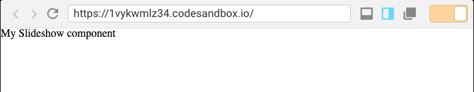

# PhotoFrame tutorial

In this tutorial we are going to build a simple picture slideshow web application. This
tutorial was written for a workshop at the TECH(K)NOW Day 2019. You can find
the [slides of the workshop here](), with an introduction to React.

Let's get started:

# Starting React application

There are multiple boilerplate tools to start a React application but a very common
one is [create-react-app](https://github.com/facebook/create-react-app), which is officially
supported by Facebook.

## Develop in the Cloud

For my workshop, I always recommend using a Cloud development environment because
it reduces the headaches debugging why something works in a machine and not in another. Everyone
has the same environment and it brings back the focus to the important matter, learning
React.

I would recommend the tool CodeSandbox.io, because it works pretty well and has a nice
IDE based on VSCode. It is great for bootstrapping a new idea.

[Create a new React app with `create-react-app` by simply clicking here.](https://codesandbox.io/s/new)

## Alternative: Develop in your machine Installing NodeJS and VSCode

The requirements to run `create-react-app` in your local machine are:

- [NodeJS](https://nodejs.org/en/). I recommend versions higher than 11.
- A code editor (IDE). I recommend [VisualStudio Code](https://code.visualstudio.com/)

If you are on Windows, I would recommend installing the Windows Subsystem for Linux (WSL)
and installing NodeJS in the WSL. Follow [this guide to get you started with WSL](https://nickjanetakis.com/blog/using-wsl-and-mobaxterm-to-create-a-linux-dev-environment-on-windows).
You can then install NodeJS [using the NodeSource installation guide](https://github.com/nodesource/distributions/blob/master/README.md).

Once you have NodeJS installed, you should be able to run this command in the
Terminal (OSX), iTerm2 (OSX), Hyper (All platforms), or terminal emulator of your choice
to create a new React app:

```
npx create-react-app my-app
cd my-app
npm start
```

Click the link provided to you in the Terminal to open in a browser the new app.

Open the `my-app` folder with VSCode to have a fully functional development environment.

# First changes to the app

Now that you have an app, open the `src/index.js` file and make some changes to the
components between the `<div className="App"></div>`.

```jsx
import React from "react";
import ReactDOM from "react-dom";

import "./styles.css";

function App() {
  return (
    <div className="App">
      {/* Make changes to elements here! And save the file to see the changes being automatically reflected in the browser. */}
    </div>
  );
}

const rootElement = document.getElementById("root");
ReactDOM.render(<App />, rootElement);
```

For example, try adding removing all the content between `<div className="App">` and the last `</div>`. You will see how
the page becomes blank. Now add a new `h1` component:

```jsx
import React from "react";
import ReactDOM from "react-dom";

import "./styles.css";

function App() {
  return (
    <div className="App">
      <h1>Hello World!</h1>
    </div>
  );
}

const rootElement = document.getElementById("root");
ReactDOM.render(<App />, rootElement);
```

# Changing the styles

You would notice there is a `src/styles.css` file, you could change the file to add any CSS rules to style
your application. Try adding `h1 { color: red }` to see how the header you just added changes it's color
to red.

The file is imported in `src/index.js` using the statement `import "./styles.css"`. In case you wonder what
kind of black magic makes this importing possible, you should have a look to [WebPack](https://webpack.js.org/).

Once you are done experimenting, we are going to add this to the general styles to prepare the
development of our first component:

```
body {
  margin: 0; /* Remove default body margin */
}
```

# Creating your first component

Now we are ready to create our first modular component for React.

1. Create a folder called `Components` in the `src` directory.
2. Create a file called `Slideshow.js` in the `Components` folder you just created. This file will have the logic for
   our component.
3. Create a file called `Slideshow.css` in the `Components` folder you just created. This file will host the styles for
   our component. We could have everything in the global `styles.css`, but is it considered a bad practice.

Open the `Slideshow.js` file and add the following boilerplate code to it:

```jsx
import React, { Component } from "react";
import "./Slideshow.css";

export class Slideshow extends Component {
  constructor() {
    super();
  }

  render() {
    return <div className="Slideshow">My Slideshow component</div>;
  }
}
```

This is the minimal component boilerplate for a components extending classes that would have
internal state. This component will have internal state because it will maintain the current photo
being displayed. There is an alternative method for components that would not have internal state, which
would be directly exporting a function, which would look like this:

```jsx
import React, { Component } from "react";
import "./Slideshow.css";

export function Slideshow(props) {
  return <div className="Slideshow">My Slideshow component</div>;
}
```

However, we will stick to the class component because it will be more useful, as we want to add state
and other helper functions.

# Importing the Slideshow component

We have created a component, but you'd notice that nothing is displayed in the browser. What is happening?
We did not import that component in the parent application component `src/index.js`. We need to import it and
instantiate it there.

1. Open the `src/index.js` file
2. Import the new component using `import { Slideshow } from './Components/Slideshow`
3. Create a new React element using the JSX notation `<Slideshow />`

The `src/index.js` file should look like this now:

```jsx
import React from "react";
import ReactDOM from "react-dom";
import { Slideshow } from "./Components/Slideshow";

import "./styles.css";

function App() {
  return (
    <div className="App">
      <Slideshow />
    </div>
  );
}

const rootElement = document.getElementById("root");
ReactDOM.render(<App />, rootElement);
```

Now the component we created is being displayed:

.

# Adding static files to `public` folder

If you want some static files to be available for in the root directory
you could add them to the `public` folder. E.g. if you add a picture file
named `photo1.jpg` to the `public` folder, the file will be available at the
URL: `http://HOST:PORT/photo1.jpg`.

1. Download 7 pictures you like, they could be from your family or friends
   for a personal touch.
2. Rename them to `photo1.jpg`, `photo2.jpg`, `photo3.jpg`, `photo4.jpg`,
   `photo5.jpg`, `photo6.jpg`, `photo7.jpg`.
3. Add them to the `public` folder.
4. Confirm that if you add `/photo1.jpg` to the URL, it loads the image.

# Loading the images in Slideshow

Now that we have all the images available for use by the application,
we are going to load them all in the Slideshow component:

1. Open the `src/Components/Slideshow.js` file
2. Add a constant at the top, after the imports with the total amount
   of pictures `const NUMBER_PHOTOS = 7;`
3. Add an initial state at the end of the constructor: `this.state = { photoNumber: 1 };`
4. Add the following method to the class:

```jsx
renderPictures() {
  let pictures = [];
  for (let i = 1; i <= NUMBER_PHOTOS; i++) {
    const className = i === this.state.photoNumber ? "active" : "";
    const src = `/photo${i}.jpg`;
    pictures.push();
  }
  return pictures;
}
```

5. Finally, use the `renderPictures` method in the `render` function:

```jsx
render() {
  return <div className="Slideshow">{this.renderPictures()}</div>;
}
```

The file should finally look like this:

```jsx
import React from "react";
import "./Slideshow.css";

const NUMBER_PHOTOS = 7;

export class Slideshow extends React.Component {
  constructor() {
    super();
    this.state = {
      photoNumber: 1
    };
  }

  renderPictures() {
    let pictures = [];
    for (let i = 1; i <= NUMBER_PHOTOS; i++) {
      const className = i === this.state.photoNumber ? "active" : "";
      const src = `/photo${i}.jpg`;
      pictures.push();
    }
    return pictures;
  }

  render() {
    return <div className="Slideshow">{this.renderPictures()}</div>;
  }
}
```

# Styling the Slideshow component

The images are being correctly loaded, but they are too big, and don't
adapt to the screen. In order to fix this, we are going to add some styles
to the component:

1. Open the `src/Components/Slideshow.css` file:
2. Add the following styles to the file:

```css
.Slideshow {
  width: 100vw;
  height: 100vh;
}

.Slideshow img {
  position: absolute;
  top: 0;
  left: 0;
  width: 100%;
  height: 100%;
  object-fit: cover;
  opacity: 0;
  transition: 0.5s opacity;
}

.Slideshow img.active {
  opacity: 1;
}
```

Only the first image should be displayed now, and it adapts to the
screen width and height. Great!

# Changing pictures

Now we want the `Slidshow` component to change the picture every few
seconds, because otherwise it would not be a slideshow.

1. Open the `src/Components/Slideshow.js` file
2. Add this method to the class:

```jsx
changePicture = () => {
  if (this.state.photoNumber + 1 > NUMBER_PHOTOS) {
    this.setState({
      photoNumber: 1
    });
  } else {
    this.setState({
      photoNumber: this.state.photoNumber + 1
    });
  }
};
```

3. Execute the method every few seconds adding a `setInterval` to the
   constructor `setInterval(this.changePicture, 5000);`

The file should look like this at the end:

```jsx
import React from "react";
import "./Slideshow.css";

const NUMBER_PHOTOS = 7;

export class Slideshow extends React.Component {
  constructor() {
    super();
    this.state = {
      photoNumber: 1
    };
    setInterval(this.changePicture, 5000);
  }

  changePicture = () => {
    if (this.state.photoNumber + 1 > NUMBER_PHOTOS) {
      this.setState({
        photoNumber: 1
      });
    } else {
      this.setState({
        photoNumber: this.state.photoNumber + 1
      });
    }
  };

  renderPictures() {
    let pictures = [];
    for (let i = 1; i <= NUMBER_PHOTOS; i++) {
      const className = i === this.state.photoNumber ? "active" : "";
      const src = `/photo${i}.jpg`;
      pictures.push();
    }
    return pictures;
  }

  render() {
    return <div className="Slideshow">{this.renderPictures()}</div>;
  }
}
```

Now the pictures are changing every 5 seconds, with a small transition to
smooth the change.

# Final note

This article does not cover important things about React like `props` or
lifecycle hooks. Mastering any skill takes time, but the rewards are worth it.
React would allow you to build amazing web applications, and combining
logic with the creativity required for web design is great for a healthy brain :).

Please, let me know if you have any questions about the content in this
tutorial or any other query. You can find me and all the ways to contact
me at [www.carlosbaraza.com](https://www.carlosbaraza.com)!
